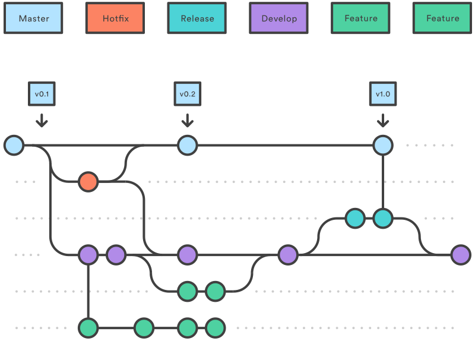

<p align="center">
  <a href="" rel="noopener">
 </a>
</p>

<h3 align="center">Frontend Boilerplate</h3>

<div align="center">

</div>

---

<p align="center"> 
 This repository contains the boilerplate we use in our nextjs frontend developments
  <br> 
</p>

## 📝 Table of Contents

- [📝 Table of Contents](#-table-of-contents)
- [📜 About ](#-about-)
- [🎬 Getting Started ](#-getting-started-)
  - [Prerequisites](#prerequisites)
  - [Installing](#installing)
- [Husky ](#husky-)
  - [Commit-msg](#commit-msg)
  - [Pre-Commit](#pre-commit)
  - [Pre-Push](#pre-push)
- [🎈 Usage ](#-usage-)
- [🧪 Tests ](#-tests-)
- [🧑‍💻 Git Workflow ](#-git-workflow-)
- [🤝 Contribute ](#-contribute-)
- [🚀 Deployment ](#-deployment-)

## 📜 About <a name = "about"></a>

- The Portal frontend application is built using [Next.js](https://nextjs.org/) app router with [TypeScript](https://www.typescriptlang.org/).
- The application is styled using [Tailwind](https://tailwindcss.com/).
- The application is linted using [ESLint](https://eslint.org/), and [Prettier](https://prettier.io/) .
- For state management, the applications uses the [Zustand](https://zustand-demo.pmnd.rs/) state management which should be more suitable for complex global state management.
- Tests are written using [Vitest](https://vitest.dev/) and [React Testing Library](https://testing-library.com/docs/react-testing-library/intro/).
- We automate some features git using [Husky](https://typicode.github.io/husky/#/)
- For work with validations in the best way, we use [Zod](https://zod.dev/), [Zod](https://zod.dev/) is a TypeScript-first schema declaration and validation library. I'm using the term "schema" to broadly refer to any data type, from a simple string to a complex nested object.
- For forms using [React-hook-forms](https://react-hook-form.com/) is a lightweight and efficient library for managing forms in React applications. It allows for the creation of flexible and high-performing forms using React hooks to simplify state management and field validation.
- For general icons we use [iconify](https://iconify.design/)

## 🎬 Getting Started <a name = "getting_started"></a>

These instructions will get you a copy of the project up and running on your local machine for development purposes. See [deployment](#deployment) for notes on how to deploy the project on a live system.

### Prerequisites

You need to have [Node.js](https://nodejs.org/en/) at least version 16 installed on your machine.
The package manager used in this project is [NPM](https://www.npmjs.com/) at version 7.x.x.

### Installing

Once you have all the prerequisites and the repository cloned, you can install the dependencies by running:

```
npm install
```

For local development the application uses the `.env.local` file. You can copy the `.env.local.example` file and rename it to `.env.local.dev` and fill the variables with the correct values.

The valid environment variables can be found at the project Slite. If you don't have access to the project Slite, please contact the project owner.

## Husky <a name = "husky"></a>

This project uses Husky to ensure commit integrity and code consistency. Below are the steps performed during different phases of the development workflow:

### Commit-msg

Commitlint: Verifies if commits adhere to specified rules, ensuring consistency and clarity in commit messages.

### Pre-Commit

Lint-staged: Before committing, linting is executed on modified files, ensuring that the code follows established standards.

Prettier: Automatically formats files to maintain a uniform style, facilitating code readability and maintenance.

### Pre-Push

Tests: Before pushing to the remote repository, automated tests are executed to ensure code integrity.

Build: A build process is triggered to prepare the code for deployment, ensuring it is ready to be integrated into the production environment.

## 🎈 Usage <a name="usage"></a>

To run the application in development mode, run:

```
npm run dev
```

The application will be available at [http://localhost:3000](http://localhost:3000).

By default the application has hot reload enabled, so any changes you make to the code will be reflected in the browser.

## 🧪 Tests <a name = "tests"></a>

The application has unit tests and integration tests. The tests are located in the same folder as the code they are testing. Test files should be named `<file-name>.spec.tsx` . The tests are run using the following command:

```
# run vitest
npm run test
```

```
# run vitest tests with coverage
npm run test:coverage
```

A test suit should be grouped in a `describe` statement and each test should follow the structure

```
it('should <expected behavior>', () => {
  // arrange
  // act
  // assert
})
```

## 🧑‍💻 Git Workflow <a name="git-workflow"></a>

The Git workflow adopted in this project is on the model of the following image:



The workflow should proceed as follows:

- The `main` branch is the production branch. It should contain only code that is in production. We use tags to mark the versions that are in production. If a fix is needed in production, a `hotfix` branch should be made from the tag of the version that is in production.

- The `release` branches should be created from the `develop` branch. The release branch should be named `release/<version-number>`. The version number should follow the [Semantic Versioning](https://semver.org/) format. The release branch should be merged into `main` and `develop` branches. The code on `release` branches should be tested by QA before being merged into `main`.

- The `develop` branch is the development branch. It should contain the code that is in development. New features should be created from the `develop` branch. The code ready in develop should go to QA for testing. After code is tested a branch of release should be created from develop.

- `feature` branches should be created from develop. The feature branch should be named `feat/<JIRA Card>`. The feature branch should be merged into `develop` branch. The code on `feature` branches can be tested by QA before being merged into `develop`.

## 🤝 Contribute <a name = "contribute"></a>

A new feature can be added following the steps defined on our [Git Workflow](#git-workflow) section.
A PR template is provided to help with this. It is strongly recommended to follow the steps defined on the PR template and provide as much information as possible, including screenshots and gifs.

Once you have your feature branch ready, you can open a pull request to the `develop` branch. The pull request should be reviewed by at least one other developer before being merged.

The pull request should have a title that describes the feature and a description that explains the feature and the changes made. A PR template is provided to help with this. PR suggestions should be addressed before the PR is merged.

In case of conflicts, the developer who opened the pull request is responsible for resolving the conflicts.

## 🚀 Deployment <a name = "deployment"></a>

empty

<small>README - v1.0</small>
